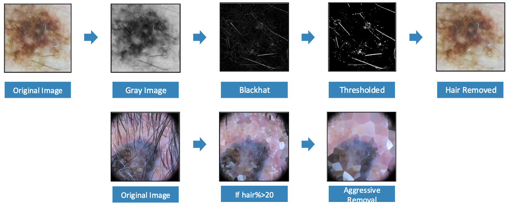
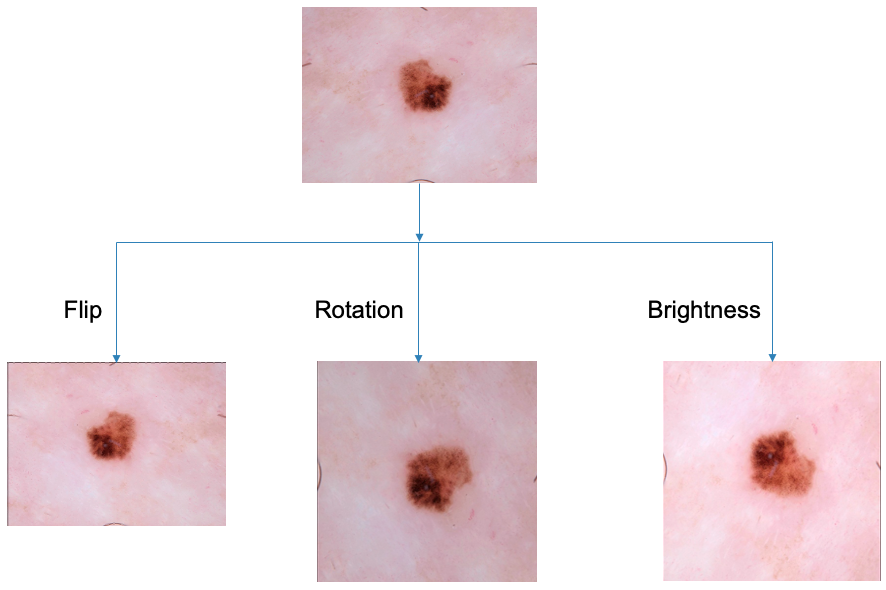

# Skin Lesion Classification
This project is a classification task to classify skin lesions, which is part of the course project for the Computer-Aided Diagnosis course at the University of Girona.

# Table of Contents
1. [Introduction](#introduction)
2. [Dataset](#dataset)
3. [Todo](#todo)
4. [Pipeline](#pipeline)
5. [Training](#training)
6. [Evaluation](#evaluation)
7. [Results](#results)
8. [References](#references)

# Introduction
Skin cancer is the most common type of cancer, and early detection is crucial for successful treatment. The goal of this project is to develop a machine learning model for 2 challenging tasks: binary classification of benign and malignant skin lesions and three classes classification of Melanoma, Basal Cell Carcinoma, and Squamous Cell Carcinoma. The model is trained using the extracted features from the images.

# Dataset
The dataset includes dermoscopic images in JPEG format with a distribution that reflects real-world settings, where benign cases outnumber malignant ones but with an overrepresentation of malignancies. The images come from:
- HAM10000 Dataset (ViDIR Group, Medical University of Vienna)
- BCN_20000 Dataset (Hospital Clínic de Barcelona)
- MSK Dataset (ISBI 2017)

The dataset consists of more than 15,000 images for binary classification and around 6,000 images for three classes classification. Data Distribution of two and three classes classification is shown below:
    
    

        *Distribution of binary classes in the dataset.*
    

    
    

        *Distribution of three classes in the dataset.*
    

# Todo
- [x] Data Preprocessing
    - [x] Hair Removal
    - [x] Masking with Segmentation
- [x] Feature Extraction
    - [x] Color Histogram
    - [x] Local Binary Pattern
    - [x] Gray Level Co-occurrence Matrix
    - [x] Intensity-base features
    - [x] Bag of Visual Words
- [x] Model
    - [x] Xgboost
- [x] Training 
- [x] Evaluation
- [x] Results

# Pipeline
1. Data Preprocessing
- To improve model performance and focus on relevant image features, the following preprocessing steps are applied:
    - Hair Removal: Removes hair artifacts that could interfere with lesion analysis.
    
    - Masking with Segmentation: Isolates the lesion region, reducing the influence of background features.
    
2. Feature Extraction
    - Color Histogram: Captures color distribution within each region.
    - Local Binary Pattern (LBP): Describes texture by encoding local intensity variations.
    - Gray Level Co-occurrence Matrix (GLCM): Quantifies spatial patterns in grayscale images.
    - Intensity Histogram: Represents the distribution of pixel intensities.
    
3. Spatial Histogram Descriptor
    - Divide the image into Grid Regions
    - Compute each feature and Concatenate Histograms
    
4. Model
    - Xgboost: A gradient boosting algorithm that builds an ensemble of weak learners to improve predictive performance.

# Training
1. Data Augmentation

2. The training is done using the Xgboost model. The model is trained using the extracted features from the images.
3. Grid Search is used to find the best hyperparameters for the model.

# Evaluation
The model is evaluated on a validation set using both binary and multi-class metrics.
- Binary Classification Results

    | **Configuration**              | **Model**              | **Class** | **Precision** | **Recall** | **F1-score** | **Accuracy** |
    |----------------------------|--------------------|-------|-----------|--------|----------|----------|
    | No Preprocessing           | Bag of Words (1000) | Nevus | 0.69      | 0.65   | 0.67     | 0.6733   |
    |                            |                    | Other | 0.66      | 0.70   | 0.68     |          |
    | No Preprocessing           | XgBoost           | Nevus | 0.84      | 0.83   | 0.84     | 0.8356   |
    |                            |                    | Other | 0.83      | 0.84   | 0.83     |          |
    | Grid-Based + Grid Search CV | XgBoost1         | Nevus | 0.85      | 0.86   | 0.86     | 0.8543   |
    |                            |                    | Other | 0.85      | 0.85   | 0.85     |          |
    | Image + Segmentation       | XgBoost2          | Nevus | 0.84      | 0.86   | 0.85     | 0.8540   |
    |                            |                    | Other | 0.85      | 0.83   | 0.84     |          |
    | XgBoost1 + XgBoost2        | Ensemble          | Nevus | **0.86**      | **0.86**   | **0.86**     | **0.8611**   |
    |                            |                    | Other | **0.86**      | **0.86**   | **0.86**     |          |

- Multi-Class Classification Results

    | **Configuration**                          | **Model**  | **Class** | **Precision** | **Recall** | **F1-score** | **Kappa** |
    |--------------------------------------------|------------|-----------|---------------|------------|--------------|-----------|
    | Oversampling                           | XgBoost | Mel       | 0.90          | 0.90       | 0.90         | 0.7488    |
    |                                            |            | Bcc       | 0.84          | 0.86       | 0.85         |           |
    |                                            |            | Scc       | 0.68          | 0.57       | 0.62         |           |
    | Augmentation                           | XgBoost | Mel       | 0.92          | 0.91       | 0.92         | 0.7815    |
    |                                            |            | Bcc       | 0.85          | 0.91       | 0.88         |           |
    |                                            |            | Scc       | 0.65          | 0.50       | 0.57         |           |
    | Augmentation + Multi-LBP               | XgBoost | Mel       | 0.92          | 0.91       | 0.92         | 0.7979    |
    |                                            |            | Bcc       | 0.87          | 0.91       | 0.89         |           |
    |                                            |            | Scc       | 0.70          | **0.61**       | 0.65         |           |
    | Augmentation + Multi-LBP + Grid Search CV | XgBoost | **Mel**   | **0.93**     | **0.91**   | **0.92**     | **0.8047** |
    |                                            |            | **Bcc**   | **0.87**     | **0.92**   | **0.90**     |           |
    |                                            |            | **Scc**   | **0.72**     | 0.59   | **0.65**     |           |

    
# Results

- The best model for binary classification is the ensemble model with an accuracy of 86.11%.
- The best model for three classes classification is the XgBoost model with an kappa score of 80.47%.
- Results on test set: 6 341 images for binary classification and 2 122 images for three classes classification.

   | Binary Classification | Three Classes Classification |
    |------------------------|-------------------------------|
    | Accuracy: 0.856        | Kappa score: 0.773            |
